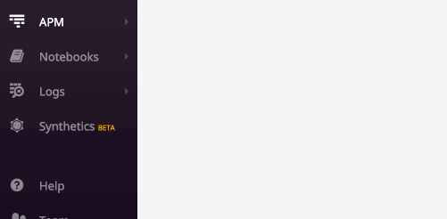

# Starting Our Microservices with Docker Compose

This APM workshop uses multiple docker images in order to build a micro services environment for local development.

We can inspect the `docker-compose.yml` in the distributed tracing folder, and see the exact services we'll be running.

Let's first bring everything up with the following command:

`DD_API_KEY=<api key> docker-compose up`{{copy}}

If you get a error: 

`cannot send spans to agent:8126: [Errno -2] Name does not resolve` 

Make sure you entered your `DD_API_KEY`. 

With the services up, we should be able to view our services running on port 5000 in the web browser here: 

https://[[HOST_SUBDOMAIN]]-5000-[[KATACODA_HOST]].environments.katacoda.com/

After clicking the link, hop into Datadog, and check to see if you're receiving traces. When you've confirmed traces are showing up, move on to the next step.

Remember, you can press CTRL+c and exit your running `docker-compose`.