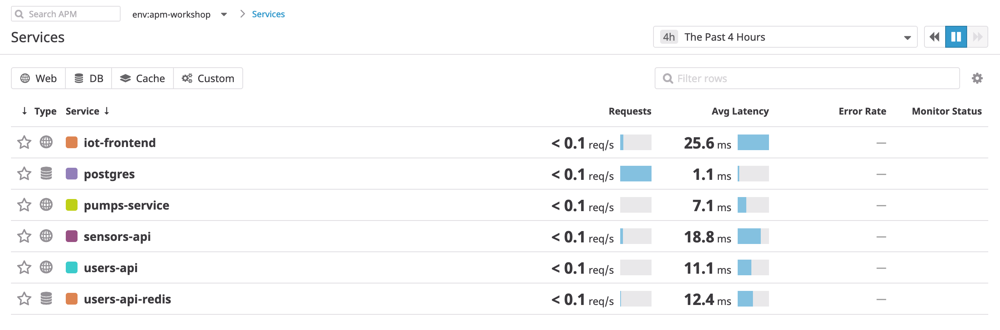

# Enabling Distributed Tracing with the Datadog Agent Container

If you paid attention when looking through our `docker-compose.yaml`, you noticed that we run a single `datadog-agent` container, which ships off the traces, logs, and metrics for our entire cluster.

Datadog's Agent is meant to be run once per host. Depending on your environment, this may mean running the Agent as a container, or as a DaemonSet. 

Open up the `docker-compose.yaml`, and let's walk through the configuration options we've enabled for this project:

```
agent:
    image: "datadog/agent:6.10.2"
    environment:
      - DD_API_KEY
      - DD_APM_ENABLED=true
      - DD_LOGS_ENABLED=true
      - DD_LOGS_CONFIG_CONTAINER_COLLECT_ALL=true
      - DD_PROCESS_AGENT_ENABLED=true
      - DD_TAGS='env:apm-workshop'
    ports:
      - "8126:8126"
    volumes:
      - /var/run/docker.sock:/var/run/docker.sock:ro
      - /proc/:/host/proc/:ro
      - /sys/fs/cgroup/:/host/sys/fs/cgroup:ro
    labels:
      com.datadoghq.ad.logs: '[{"source": "datadog-agent", "service": "agent"}]'
```

The Datadog Agent container is configured via environment variables and mounting volumes on the underlying host.  We also open up port `8126`, where traces get shipped to from the underlying applications.

The most important environment variable we set is `DD_API_KEY`, which is generated when we create an account. This is the API key used to authenticate with Datadog and add our hosts to the environment.

Next, we set `DD_APM_ENABLED` to true. Although enabled by default, setting this variable lets other people know we're using APM.

Finally, we enable logs, processes, and set an environment for our current work environment with the `DD_TAGS` variable. 

By setting a work environment, we can isolate our multiple Datadog workspaces.

Try setting the `DD_TAGS` env to `env:apm-workshop-live`, and bringing back up our environment with `DD_API_KEY=<api key> docker-compose up -d`.

You should then see the services we're running show up under Services in APM, and a new env should show up in the top left corner:



By setting our `env`, we can ensure our test traces only go to an isolated environment.

This is especially useful when we don't want to mess up other people's environments when testing or building a new service.