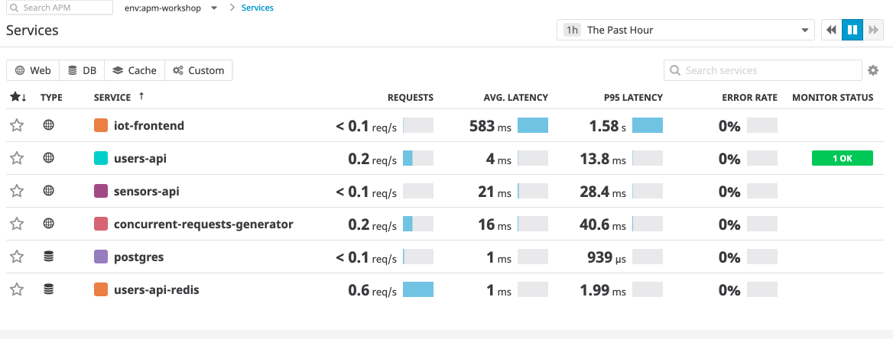
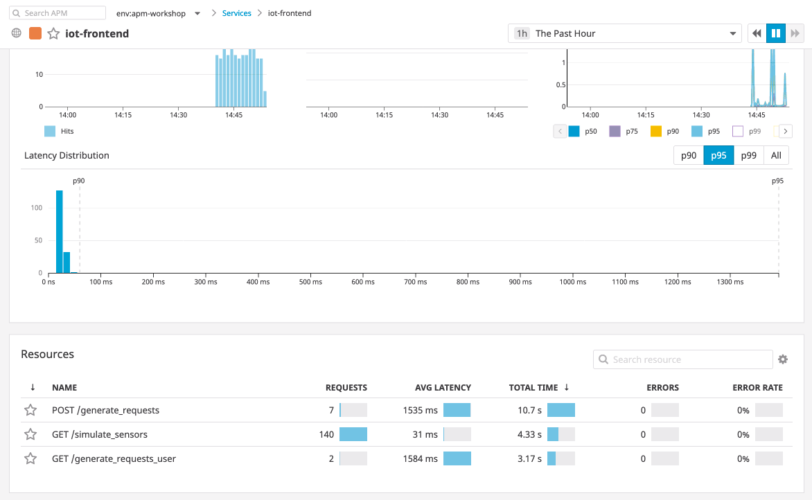

# Instrumenting an Application

Let's open up one of our microservice's source code and see how code gets instrumented with Datadog.

Find the `frontend` directory, and try opening the `api.py` file.

You'll see a few things.

```python
from ddtrace import tracer
from ddtrace.ext.priority import USER_REJECT, USER_KEEP
```

For one, we're not doing any configuration for the `tracer` object.

Instead, directly in our code, we grab our current span and add data to it.

```python
    span = tracer.current_root_span()
    app.logger.info(f"Looking at {span}")
    app.logger.info(f"with span id {span.span_id}")

    span.set_tags({'requests': payload['total'], 'concurrent': payload['concurrent']})
```

Tags within Traces allow us to set custom data to sort by in Datadog. 

We can build up dashboards based upon traces with Trace Search and Analytics, allowing us to see the experience for specific users, or specific organizations across our infrastructure.

Open up the IoT web app, and scroll to the botton and click the buttons to generate concurrent users. They're under `Generate API Traffic`.

Afterwards, jump into the Datadog APM Services page, and find the corresponding URL endpoint for `/generate_requests`.



Notice how the tags show up as information for each span. We can then slice and dice our requests with these tags with Trace Search and Analytics.



Back to the configuration of our app, the Tracer configuration lives in the original `docker-compose.yml` file. 

There, we wrap our Python application with a helper provided by the `ddtrace` library, called `ddtrace-run`.

This wrapper automatically instruments supported web frameworks. In our case, we're using Flask.

You can see this in the `command` we've set in the file. Look for other Python services and see how they were also wrapped with the `command` directive.

Besides instrumenting our application with `ddtrace-run`, we also add a name for our service via the `DATADOG_SERVICE_NAME`. In this case, our frontend application has a service name so we can see it both in services and in our service map.

For Trace Search and Analytics, we also enable with a `DD_ANALYTICS_ENABLED`, and finally, to enable log and trace correlation, we add a `DD_LOGS_INJECTION`.

Try filtering for each of our services in Trace Search and Analytics. 

Can you find any other tags we should add facets for?