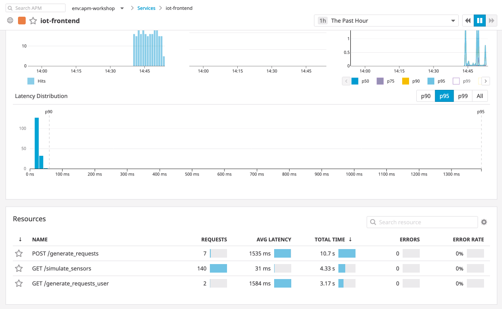

# Following a Trace Across Services

The main benefit for distributed tracing is to be able to see your requests across databases and services in a single view.

Let's now jump in to our frontend service, and look for the slowest part of our request.

As our `iot-frontend` services is just a single page app, it seems the services behind the frontend must be where bottlenecks lie.

Note here the different endpoints and how much time is spent in each.

`/simulate_sensors` has the most requests, but the lowest average latency. 

We can sort by `Total Time` in our resources tab, and find that `/generate_requests` might be the first place to look. It also has a fairly high average latency.

But let's ignore that for now, and diagnose our `pumps-service`.

Click the top of our web application to add a few pumps, and then jump into `POST /add_pump` inside of the `iot-frontend` service.

Looking at the spans, we can see the majority of time (96%!) is spent in the pumps service.