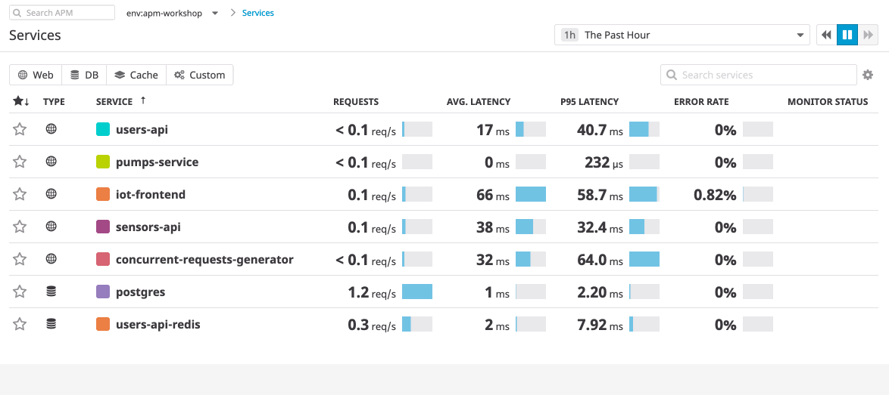

# Adding Monitors for Service Quality

If we open up the `pumps-api` directory, we can see the files that run the API.

Click into the `pumps.py` file, and open up the source code.

If you scroll down, you'll see a route for `/devices`. It has two methods, `GET` and `POST`.

In our last diagnoses, we determined the problem was the `POST` for that specific route. Can you find the bottleneck that's been adding a half a second? 

Comment it out with a `#` in front of the line.

Afterwards, go back into our app and see if adding pumps is any quicker in our web interface.

We can make sure our service endpoints don't become slow again by creating monitors.

On the Services page of Datadog, we have the ability to add Monitors to any of our services. Let's add one now for the `pumps-service`, to ensure this doesn't happen again.

We can add a high latency p90 monitor, and get a notification when the service becomes a bottleneck again.

Try playing with the configuration, and see how you can make it suit your needs.