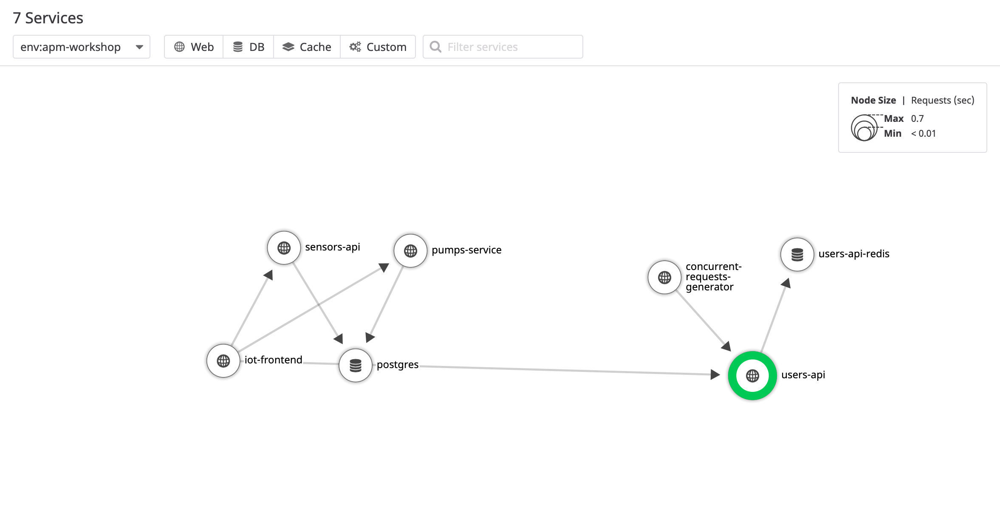

# Visualizing Dependencies with the Service Map

Let's take a look at the Service Map, and determine the dependency graph for our microservices.

Note that if you configured a monitor for your service, and it's still healthy, you'll see a green circle around it's name.

This lets you see at a glance, if all your services are healthy. 

Hovering over a service also shows the graph of what subservices rely on that specific service.

Try clicking into the `users-api` service, and selecting Inspect.

This view lets you see the service in an isolated manner, with both upsteam and downstream services.

We can tell both our `iot-frontend` and `concurrent-requests-generator` send traffic downstream to the `users-api`.

If this were a production account, we'd be able to quickly diagnose API dependencies, allowing us to see if it's safe to swap out legacy systems, or if there are still hidden pieces of code.