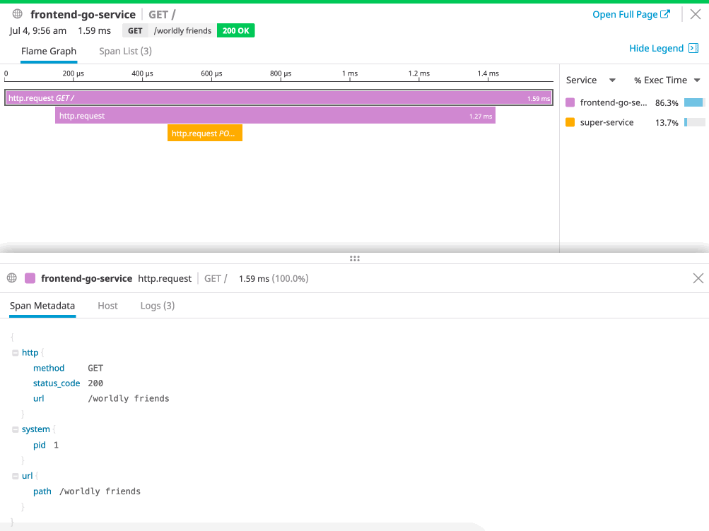

# Adding Distributed Traces for Multi System Visibility

Now that we've added traces and logs to all of our URL views, let's see how this helps when we've got a distributed system.

Switch from the `step02/` folder to the `step03/` folder, and notice that there are now two services.

When we look at each, we can see that there is now a `frontend` service, along with a `super-service` one.

Looking at the code, requests are made from the `frontend` service down to the second, `super-service`. 

There, our URL string is converted into an upper case one, and returned. Let's try making a few requests, and see what it looks like in the Datadog UI.

`DD_API_KEY=<YOURAPIKEY> docker-compose up` 

Followed by hitting some of the URLs here:

https://[[HOST_SUBDOMAIN]]-8080-[[KATACODA_HOST]].environments.katacoda.com/world

Now, if we look at the Datadog APM UI, we can see our traces as they cross services, along with the logs for both the `frontend` and `super-service` for each request in one view:

