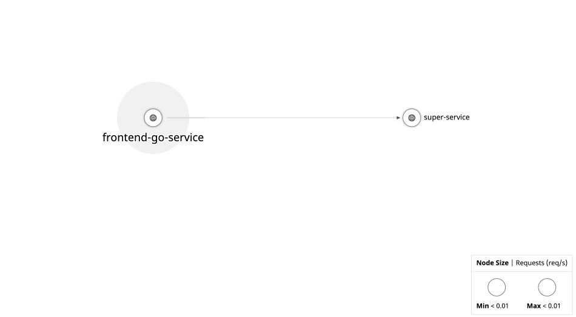

# Adding Distributed Traces for Multi System Visibility

Now that we've added traces and logs to all of our URL views, let's see how this helps when we've got a distributed system.

Switch from the `step02/` folder to the `step03/` folder, and notice that there are now two services.

When we look at each, we can see that there is now a `frontend` service, along with a `super-service` one.

Looking at the code, requests are made from the `frontend` service down to the second, `super-service`. 


There, our URL string is converted into an upper case one, and returned. Let's try making a few requests, and see what it looks like in the Datadog UI.

`DD_API_KEY=<YOURAPIKEY> docker-compose up` 

Followed by hitting some of the URLs here:

https://[[HOST_SUBDOMAIN]]-8080-[[KATACODA_HOST]].environments.katacoda.com/world

Now, if we look at the Datadog APM UI, we can see our traces as they cross services, along with the logs for both the `frontend` and `super-service` for each request in one view:


With our added services, we can also jump over into the service map, and visualize how requests get routed through our application:



Jumping back and forth between the service map and services, we're starting to see how APM gives us visibility into our services themselves, beyond just the underlying hardware and resource usage and statistics.

## Continuing Traces Across Services

But how do our traces cross services? Looking at our code, we've wrapped the http `POST` to the downstream service with a `http.WrapClient`. This client injects a `trace_id`, `parent_span_id`, along with a trace priority.

```go
	req, err := postWithContext(r.Context(), "http://super-service:8081/super", "application/json", bytes.NewBuffer(jsonValue))
	if err != nil {
		http.Error(w, err.Error(), http.StatusInternalServerError)
		return
	}

	tracedClient := httptrace.WrapClient(&http.Client{})
	resp, err := tracedClient.Do(req)
	if err != nil {
		http.Error(w, err.Error(), http.StatusInternalServerError)
		return
	}

	defer resp.Body.Close()
```

In our downstream service, because we're using the same pattern passing the `span` context, along with a `logger`, we don't need to make any changes to accept and continue propagating the trace.

Now that we've got a solid foundation for how APM works to build cross service visibility, let's add kubernetes and another existing distributed system to see how observability helps in practice.