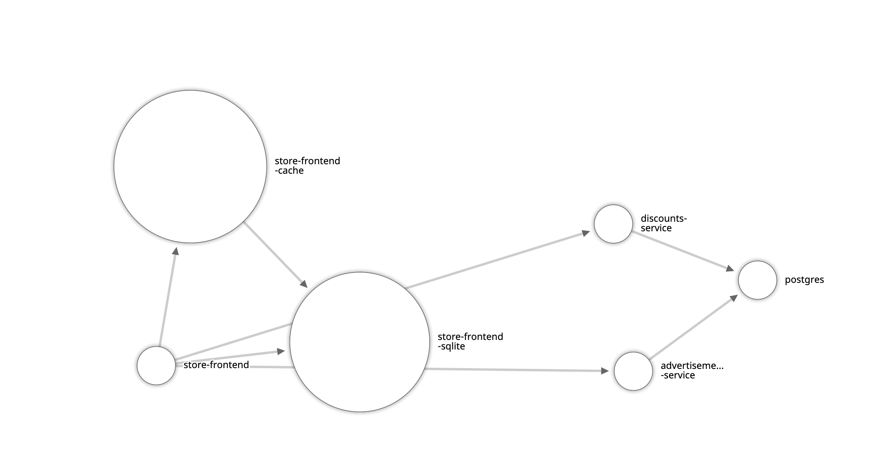

# Deploying and Quantifying Improvements

Now that we've instrumented all of our code, let's spin up some traffic so we can get a better look at what may be happening.

## Spinning up Traffic for Our Site

In our `/ecommerce-observability` folder, we've got a copy of [GoReplay](https://goreplay.org).

We've also got a capture of traffic using GoReplay. Let's spin up an infinite loop of that traffic:

```
$ ./gor --input-file-loop --input-file requests_0.gor --output-http "http://localhost:3000"
```

Once we spin up that traffic with our included observability, we can now take a look at the issues we've come across since the new team rolled out their first microservice, the `advertisements-service`.

Before we began instrumenting with Datadog, there'd been reports that the new `advertisements-service` broke the website. With the new deployment on staging, the `frontend` team has blamed the `ads-service` team, and the `advertisements-service` team has blamed the ops team.

Now that we've got Datadog and APM instrumented in our code, let's see what's really been breaking our application.

## Debugging an Application with Datadog

The first place we can check is the Service Map, to get an idea for our current infrastructure and microservice dependencies.



In doing so, we can tell that we've got two microservices that our frontend calls, a `discounts-service`, along with an `advertisements-service`.

If we click in to view our Service Overview in Datadog, we can see that our API itself isn't throwing any errors. The errors must be happening on the frontend.


So let's take a look at the frontend service, and see if we can find the spot where things are breaking.

If we look into the service, we can see that it's been laid out by views. There's at least one view that seems to only give errors. Let's click into that view and see if a trace from that view can tell us what's going on.


It seems the problem happens in a template. Let's get rid of that part of the template so we can get the site back up and running while figuring out what happened.

Open `store-frontend/app/views/spree/layouts/spree_application.html.erb` and delete the line under `<div class="container">`. It should begin with a `<br />` and end with a `</center>`.

The banner ads were meant to be put under `store-frontend/app/views/spree/products/show.html.erb` and `store-frontend/app/views/spree/home/index.html.erb`.

For the `index.html.erb`, under `<div data-hook="homepage_products">` add the code:

```ruby
<br /><center><a href="<%= @ads['url'] %>">" /></a></center>

```

And for the `show.html.erb` at the very bottom add:

```ruby 
<br /><center><a href="<%= @ads['url'] %>">" /></a></center><br />
```

With that, our project should be up and running. Let's see if there's anything else going on.


